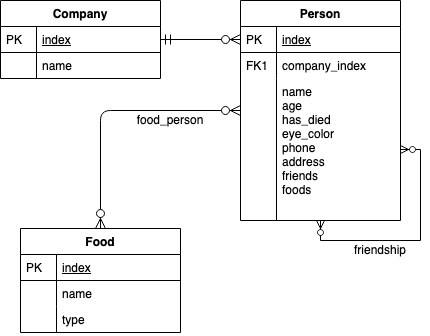

# Implementation
This is the implementation for the Paranuara Challenge. The implementation makes use of python3, flask and SQLAlchemy with SQLite.
Listed below are the installation instructions and some notes on the design of the solution.

### Endpoints
#### Company
- Company's details `/api/v1/company/<company_id>`
- Company's employees `/api/v1/company/<company_id>/employees`
#### Person
- Person's details `/api/v1/person/<person_id>`
- Common friends of two people `/api/v1/person/common-friends/<person_id_1>/<person_id_2>`

## Installation
Using virtualenv or docker.
### Virtualenv
- `git clone https://github.com/bachtran/paranuara.git`
- `cd paranuara`
- `python3 -m venv venv`
- `. venv/bin/activate`
- `pip install -r requirements.txt`
- `export FLASK_APP=paranuara.py`
- To test `flask test`
- To import data (companies.json and people.json in resources directory) `flask import-data`
- To run the app `flask run`
### Docker
- `git clone https://github.com/bachtran/paranuara.git`
- `cd paranuara`
- `docker-compose up -d`
- To test `docker-compose exec app flask test`
- To import data `docker-compose exec app flask import-data`

## Design assumption
### Data model design
- Attempt was made to map the provided json resources to a relational model and implemented using SQLite.
- As only certain fields are required to implement the features, I decide to not model unrelated fields, 
such as tags, picture, about, etc...
 

### Data processing and import
While processing the resources, I consider a few factors as below:
- There are user records with invalid company index, thus it's reasonable to skip such records.
- There are friendships to oneself, which is skipped as well.
- I preload the food types to split food item into vegetables and fruits. In this solution I build the food types mapping by manually examining the food types
in the dataset as a whole. However, I think this could be improved by sourcing a more robust source of food types, from
an external API for instance.
### App structure
From the lowest level, there are:
- A database abstraction layer built using SQLAlchemy (`app.models`).
- A service layer that contains business logic and relies on the database layer (`app.services`).
- A controller/view layer built with Flask Blueprint (`app.api`). As the view portion is quite simple in this case, I choose to have it
together with the controller instead of separately.
### Tests
- In the `tests` directory. Which could be run with `flask test` after `export FLASK_APP=paranuara.py`.
- There are unit tests for the models and services.
- There are end-to-end tests for the API.
